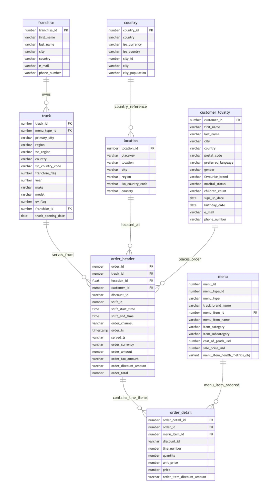
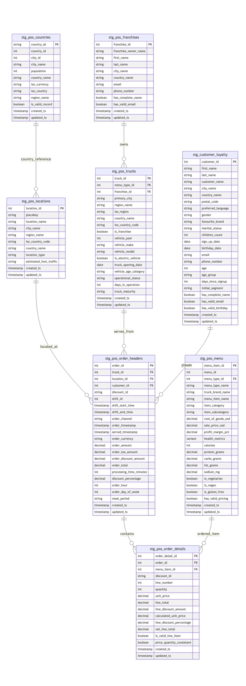
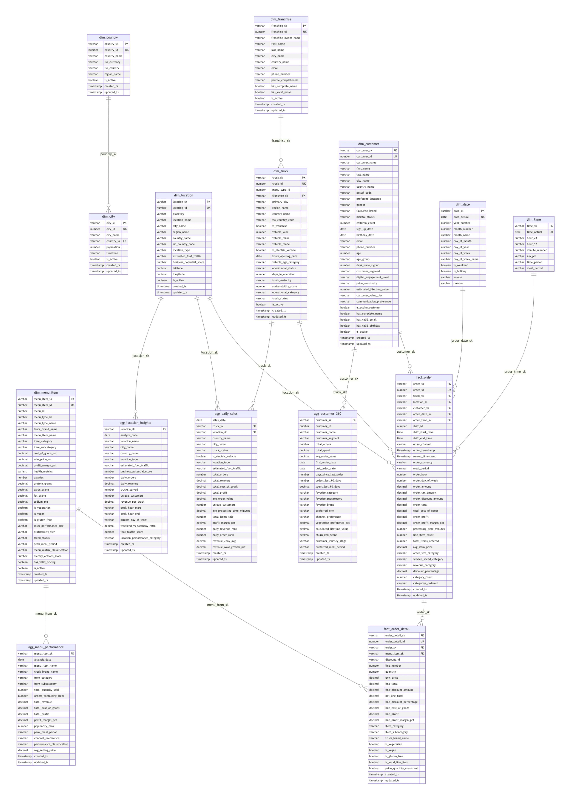

# 🚀 Open Source Analytics Accelerator: 
# 📊 Airflow-Cosmos + dbt + ClickHouse

A complete **end-to-end analytics platform** that integrates:

- **ClickHouse** → Fast OLAP database
- **dbt** → Transformations (bronze → silver → gold layers)
- **Airflow + Cosmos** → Orchestration
- **Astro (Docker)** → Local Airflow runtime

This project demonstrates a **Food Truck Analytics** pipeline: from raw orders, menus, trucks, and sessions → to cleaned marts with daily sales, funnels, and top locations.

---

## ✨ Features

- ✅ Ready-to-use **local stack** with Astro CLI
- ✅ **Cosmos integration** to run dbt commands inside Airflow DAGs
- ✅ **ClickHouse adapter for dbt** preconfigured
- ✅ **Food Truck demo models** with seeds, tests, and marts
- ✅ Modular folder structure for DAGs, dbt project, and configs

---

## 🏗️ Architecture

```
            ┌───────────────────────────────────┐
            │         Astro (Docker)            │
            │  Airflow: Webserver | Scheduler   │
            └───────────────┬───────────────────┘
                            │
                      Cosmos Operator
                            │
                            ▼
                     ┌──────────────-┐
                     │     dbt       │
                     │ (models/tests)│
                     └──────┬────────┘
                            │
                            ▼
                     ┌──────────────---┐
                     │  ClickHouse     │
                     │ raw→bronze→gold |
                     └──────────────---┘
```

---

## 📂 Repository Layout

```
.
├─ dags/                     # Airflow DAGs (Cosmos dbt orchestration + helpers)
├─ analytics/                # dbt project (models, seeds, profiles)
├─ include/                  # Assets available to Airflow at runtime
├─ tests/                    # DAG/unit tests with pytest
├─ Dockerfile                # Astro base image + dependencies
├─ requirements.txt          # Python deps (dbt, cosmos, clickhouse-connect, etc.)
├─ docker-compose.override.yml
└─ README.md
```

---

## ⚡ Quickstart

### 1. Install prerequisites

- [Docker](https://docs.docker.com/get-docker/)
- [Astro CLI](https://www.astronomer.io/docs/astro/cli/install-cli)

### 2. Start Airflow (Astro)

```bash
# from repo root
astro dev start
```

UI available at 👉 [http://localhost:8080](http://localhost:8080)  
(Default: user `admin` / pwd `admin`)

### 3. Configure connections

In Airflow UI → _Admin → Connections_:

### 4. Configure dbt

Edit `analytics/profiles.yml`:

### 5. Run pipeline

- Trigger DAG: `food_truck_data_pipeline`

---

## Injestion Pipeline Setup

- Config Driven: 
- For DDL statements and S3 path
- Edit `dags/config/tables_info.py`:

**🔧 .evv file :**

**CLICKHOUSE CONFIGURATION**

CLICKHOUSE_HOST=host.docker.internal

CLICKHOUSE_PORT=8123

CLICKHOUSE_USER=

CLICKHOUSE_PASSWORD=

CLICKHOUSE_DATABASE=

**AWS S3 CONFIGURATION**

AWS_ACCESS_KEY_ID=

AWS_SECRET_ACCESS_KEY=

AWS_REGION=us-east-1

S3_BUCKET=your-bucket

S3_PREFIX=food_truck/raw/


## 🍽️ Food Truck Demo Models

**Raw (landing):**

- `raw_truck`, `raw_menu`, `raw_order`, `raw_location`,..



**Silver (conformed):**

- - `stg_truck`, `stg_menu`, `stg_order`, `stg_location`,..



**intermediate (conformed):**

- - `int_customer_segmented`, `int_menu_profitability`,

**Gold (marts):**

- `mart_daily_sales` → sales KPIs
- `mart_top_locations` → best-performing areas
- `mart_funnel` → order funnel analysis
- `mart_peak_hours` → hourly sales



---

## 🧪 Testing (optional)

- **dbt tests**: run inside Airflow task `dbt_test`
- **DAG tests**:

```bash
pytest -q
```

---

## 🔧 Development workflow

```bash
# stop services
astro dev stop

# rebuild with deps
astro dev restart --rebuild

# view logs
astro dev logs -f
```

---

## 🚀 Roadmap

- [ ] Add Kafka → ClickHouse streaming ingest example
- [ ] CI pipeline with `dbt build --warn-error`
- [ ] Preconfigured dashboards - `superset`

---

## 📜 License

MIT (or update to your org’s preference)

---

## 🙌 Credits

Built with ❤️ by [SaiPurushoth](https://github.com/SaiPurushoth)  
Powered by **Astro**, **Airflow**, **dbt**, **Cosmos**, and **ClickHouse**
