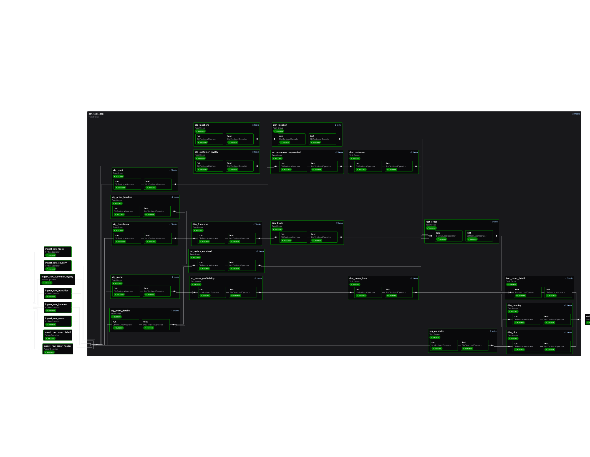

# 🚀 Open Source Analytics Accelerator:

# 📊 Airflow-Cosmos + dbt + ClickHouse

A complete **end-to-end analytics platform** that integrates:

- **ClickHouse** → Fast OLAP database
- **dbt** → Transformations (bronze → silver → gold layers)
- **Airflow + Cosmos** → Orchestration
- **Astro (Docker)** → Local Airflow runtime

This project demonstrates a **Food Truck Analytics** pipeline: from raw orders, menus, trucks, and sessions → to cleaned marts with daily sales, funnels, and top locations.

---

## ✨ Features

- ✅ Ready-to-use **local stack** with Astro CLI
- ✅ **Cosmos integration** to run dbt commands inside Airflow DAGs
- ✅ **ClickHouse adapter for dbt** preconfigured
- ✅ **Food Truck demo models** with seeds, tests, and marts
- ✅ Modular folder structure for DAGs, dbt project, and configs

---

## 🏗️ Architecture

```
            ┌───────────────────────────────────┐
            │         Astro (Docker)            │
            │  Airflow: Webserver | Scheduler   │
            └───────────────┬───────────────────┘
                            │
                      Cosmos Operator
                            │
                            ▼
                     ┌──────────────-┐
                     │     dbt       │
                     │ (models/tests)│
                     └──────┬────────┘
                            │
                            ▼
                     ┌──────────────---┐
                     │  ClickHouse     │
                     │ raw→bronze→gold |
                     └──────────────---┘
```

### DAG Lineage



*Complete data lineage showing the flow from raw data through staging, intermediate, and marts layers*

---

## 📂 Repository Layout

```
.
├─ dags/                     # Airflow DAGs (Cosmos dbt orchestration + helpers)
├─ analytics/                # dbt project (models, seeds, profiles)
├─ include/                  # Assets available to Airflow at runtime
├─ tests/                    # DAG/unit tests with pytest
├─ Dockerfile                # Astro base image + dependencies
├─ requirements.txt          # Python deps (dbt, cosmos, clickhouse-connect, etc.)
├─ docker-compose.override.yml
└─ README.md
```

---

## ⚡ Quickstart

### 1. Install prerequisites

- [Docker](https://docs.docker.com/get-docker/)
- [Astro CLI](https://www.astronomer.io/docs/astro/cli/install-cli)

### 2. Start Airflow (Astro)

```bash
# from repo root
astro dev start
```

UI available at 👉 [http://localhost:8080](http://localhost:8080)  
(Default: user `admin` / pwd `admin`)

### 3. Configure connections

In Airflow UI → _Admin → Connections_:

### 4. Configure dbt

Edit `analytics/profiles.yml`:

### 5. Run pipeline

- Trigger DAG: `food_truck_data_pipeline`

---

## 🔧 Ingestion Pipeline Setup

- Config Driven:
  DDL statements and S3 paths in `dags/config/tables_info.py`, and set the following environment variables in your `.env` file:

```env
# ⚙️ ClickHouse Configuration
CLICKHOUSE_HOST=host.docker.internal
CLICKHOUSE_PORT=8123
CLICKHOUSE_USER=
CLICKHOUSE_PASSWORD=
CLICKHOUSE_DATABASE=

# ☁️ AWS S3 Configuration
AWS_ACCESS_KEY_ID=
AWS_SECRET_ACCESS_KEY=
AWS_REGION=us-east-1
S3_BUCKET=your-bucket
S3_PREFIX=food_truck/raw/
```

## 🍽️ Food Truck Demo Models

### Data Pipeline Overview

**20 Models | 143 Tests | 3-Layer Medallion Architecture**

### Raw Layer (Bronze)
8 source tables loaded from S3:
- `raw_franchise` - Franchise owner information
- `raw_country` - Country and city master data
- `raw_customer_loyalty` - Customer loyalty program data
- `raw_truck` - Food truck fleet information
- `raw_location` - Operating location details
- `raw_menu` - Menu items and pricing
- `raw_order_header` - Order transaction headers
- `raw_order_detail` - Order line items


### Staging Layer (Silver)
8 staging models with data cleaning and standardization:
- `stg_countries` - Cleaned country/city data with region classifications
- `stg_franchises` - Validated franchise owner information
- `stg_locations` - Cleaned location data with business classifications
- `stg_menu` - Standardized menu items with dietary flags
- `stg_truck` - Cleaned truck fleet data with operational status
- `stg_customer_loyalty` - Validated customer data with age groups
- `stg_order_headers` - Cleaned order headers with meal period classification
- `stg_order_details` - Validated order line items


### Intermediate Layer
3 models with business logic and enrichment:
- `int_customers_segmented` - RFM analysis and customer segmentation
- `int_menu_profitability` - Menu item profitability metrics
- `int_orders_enriched` - Order-level calculations and enrichments

### Marts Layer (Gold)
**Star Schema: 7 Dimensions + 2 Facts**

**Dimension Tables:**
- `dim_country` - Country master with ISO codes and currency
- `dim_city` - City details with population and timezone
- `dim_location` - Locations with business potential scores
- `dim_franchise` - Franchise owners with profile completeness
- `dim_truck` - Truck fleet with sustainability and operational metrics
- `dim_customer` - Customer 360 with segmentation and lifetime value
- `dim_menu_item` - Menu catalog with profitability classifications

**Fact Tables:**
- `fact_order` - Order transactions with all dimensional relationships
- `fact_order_detail` - Line-item level details with profit margins


### Key Features

✨ **Customer Analytics**
- RFM segmentation (VIP, Loyal, Regular, At Risk, etc.)
- Lifetime value estimation (up to $200K for VIP customers)
- Communication preference analysis

✨ **Menu Optimization**
- BCG matrix classification (Stars, Cash Cows, Dogs, Question Marks)
- Profitability analysis with margin tracking
- Dietary accommodation scoring

✨ **Operational Metrics**
- Truck sustainability scoring (EV flagging, vehicle age)
- Location business potential analysis
- Order channel and meal period tracking

✨ **Data Quality**
- 143 comprehensive tests across all layers
- Primary key uniqueness validation
- Foreign key integrity checks
- Business rule validations

---

## 🧪 Testing

### dbt Tests
**143 data quality tests** covering:
- ✅ Primary key uniqueness and NOT NULL constraints
- ✅ Foreign key NOT NULL validations
- ✅ Categorical value validations (order channels, meal periods, etc.)
- ✅ Range validations for critical metrics (customer age, menu prices, LTV)
- ✅ Data quality flags (valid pricing, completeness checks)

**Run tests via Airflow:**
- Tests execute automatically in the `dbt_test` task within the DAG

**Run tests locally:**
```bash
cd analytics
dbt test
```

### DAG Tests
```bash
pytest tests/dags/ -v
```

### ClickHouse Compatibility
✅ All tests optimized for ClickHouse:
- Boolean values stored as UInt8 (0/1)
- Explicit NULL type casting for nullable columns
- Test strategy focused on data integrity, not business variability

---

## 🔧 Development workflow

```bash
# stop services
astro dev stop

# rebuild with deps
astro dev restart --rebuild

# view logs
astro dev logs -f
```

---

## 🚀 Roadmap

- [ ] Add Kafka → ClickHouse streaming ingest example
- [ ] CI pipeline with `dbt build --warn-error`
- [ ] Preconfigured dashboards - `superset`

---

## 📜 License

MIT (or update to your org’s preference)

---

## 🙌 Credits

Built with ❤️ by [SaiPurushoth](https://github.com/SaiPurushoth)  
Powered by **Astro**, **Airflow**, **dbt**, **Cosmos**, and **ClickHouse**
